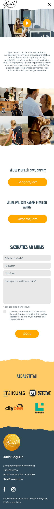
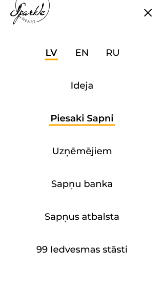
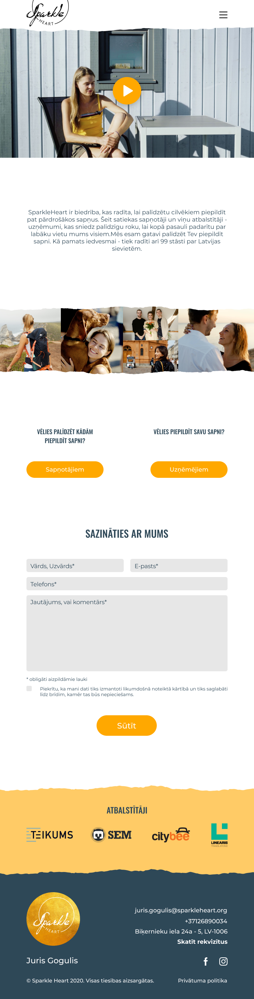

# Internship project
[Find the project here.](https://lienebriede.github.io/qualification-project-css-piere/)

This webpage I made on the basis of these Figma files that were provided.
It is made using HTML and CSS.

<h2>&nbsp; &nbsp;&nbsp; &nbsp;</h2>
